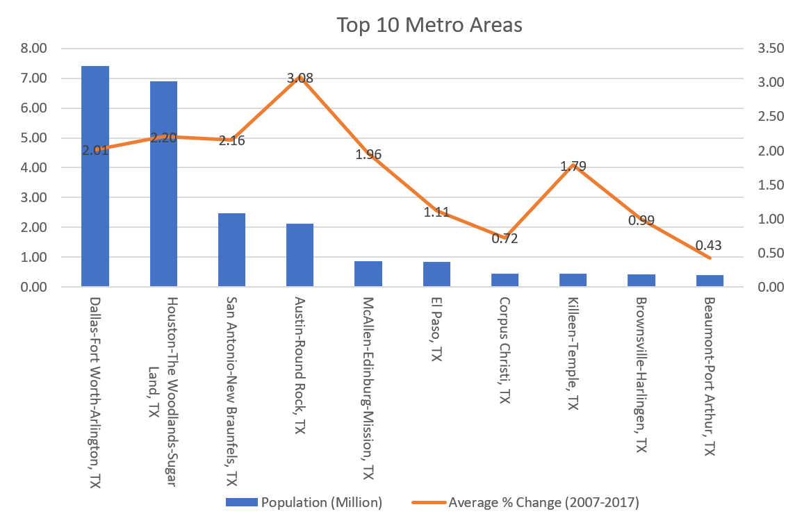
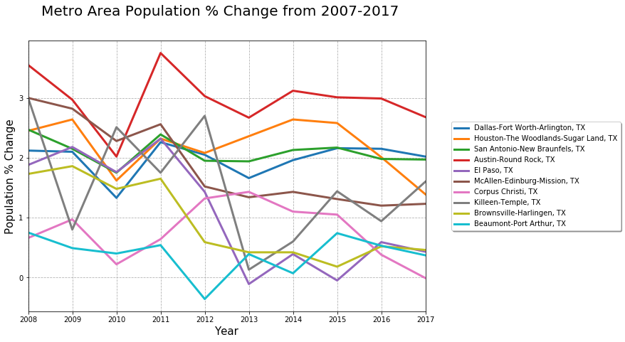
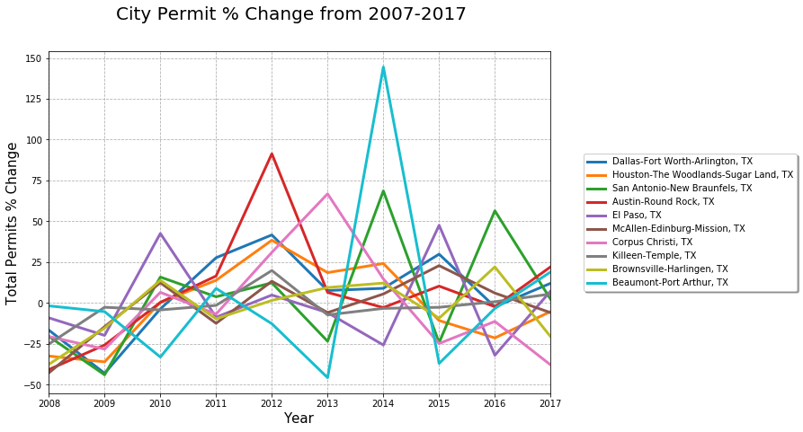
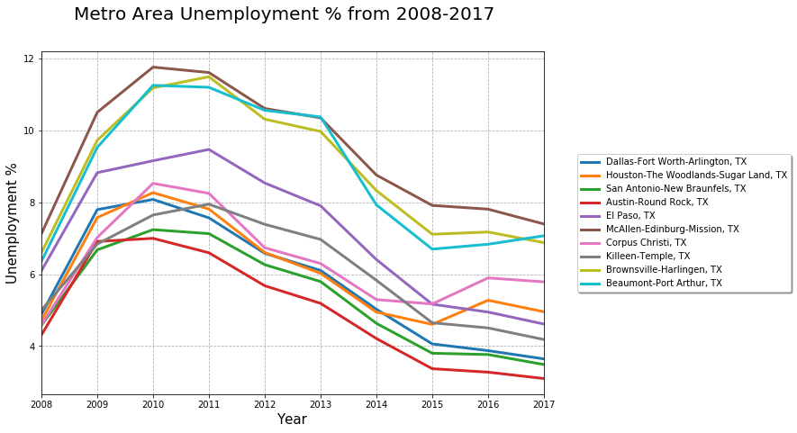
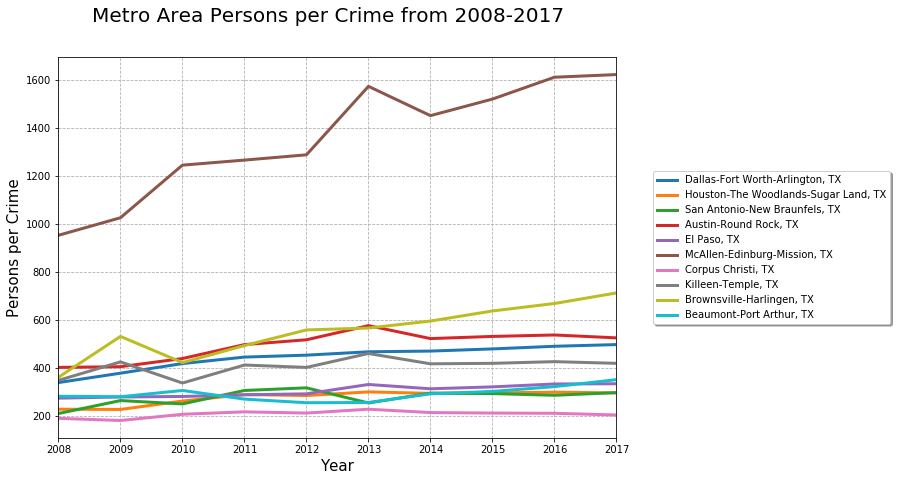
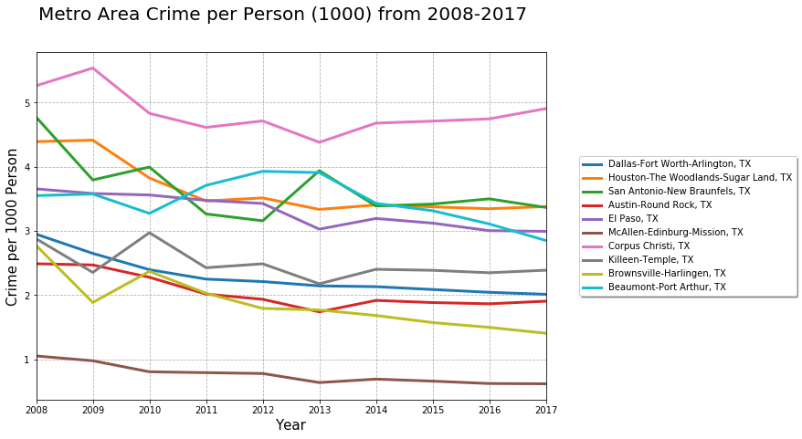

# Top 10 Metro Area in Texas

 Population vs. Unemployment, Total construction permits and Crime rate.

### Team Members:

Murtadha Almayahi, Ryan Frescas , Andre Ottoni, Abdullah Suzek, Wee Kim (Jeff) Wong  

### Project Description:

We analyzed data from the main Texas metro areas during 2007-2017 to find trends/correlation between population, unemployment rate, total permits, and crime rate.  

### Hypothesis:
A regions population growth/decline has some correlations with factors such as crime rate, unemployment rate etc.

### Data Sources:

Real Estate Center at Texas A&M University

Uniform Crime Reporting Statistics: U.S. Department of Justice and Federal Bureau of Investigation
 
### Breakdown of Tasks:  
Investigate and identify data sources  
Collect data sets  
Perform first screening on data sets  
Breaking down data for further analysis  
Get population Data  
Get unemployment Data  
Get total construction permit Data  
Get crime rate Data  
Perform data cleansing and merge  
Graphs using Matplotlib  
  
### Q&A:  
1- What are the top 10 metro areas in Texas by highest population in average from 2007 to 2017?

 

Austin Metropolitan area has the highest population growth rate from 2007 to 2017.

2- What results can be deducted from the population growth chart?

Austin metro area has a consistent growth rate year over year whereas Beamount - Port Arthur has the highest changes in the rate.

3- Which metro area has the highest construction permit and population grow?

 
 
 There is a correlation beteween the growth the permit and the population growth the year after.
 
4- What is the yearly unemployment rate for each of the top 10 metro areas?

 
Austin metro area has the lowest unemployment rate.

5- Which metro area has the highest crime rate?

 

 
 
 
 The highest crime rate is in Corpus Christi.
